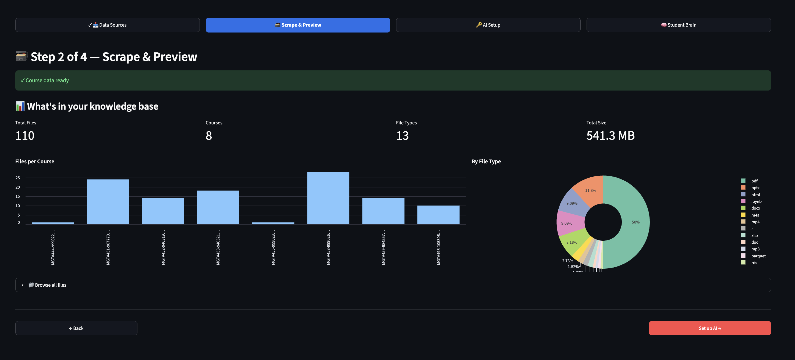
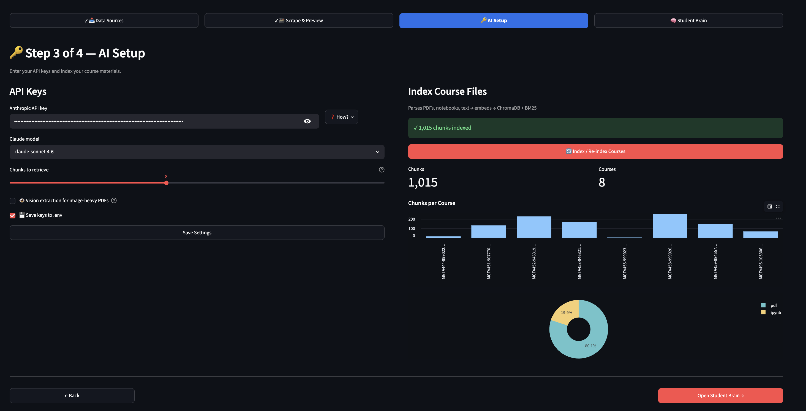
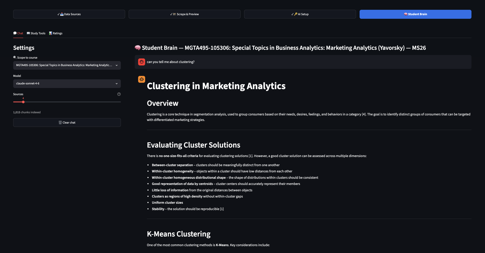
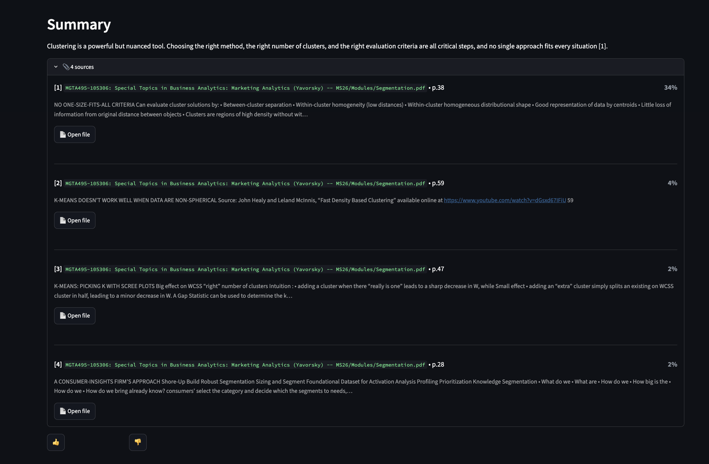
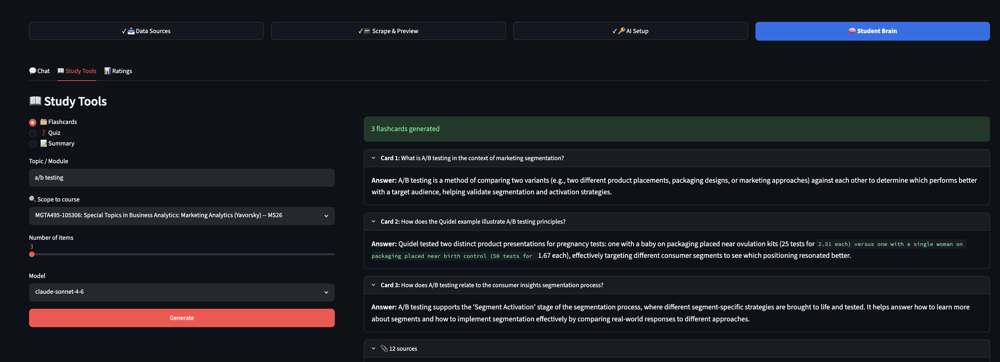

## The Problem {background-color="#0d1117"}

The problem

::: {.qbox}
"It's midnight before finals. I *know* there was a slide about regularization somewhere — was it in the ML course or the analytics one? Let me just check Canvas real quick."
:::

:::: {.columns}

::: {.column width="32%"}

<h4>Canvas is a maze</h4>

Modules buried under weeks of content. Click, scroll, download, repeat. Every file requires its own hunt.

:::

::: {.column width="2%"}
:::

::: {.column width="32%"}

<h4>100+ files, zero search</h4>

PDFs, notebooks, slides scattered across 8 courses with no unified view. Ctrl+F gets you nowhere.

:::

::: {.column width="2%"}
:::

::: {.column width="32%"}

<h4>By finals week: chaos</h4>

You're not sure what you have, what you've read, or where anything lives anymore.

:::

::::

::: {.notes}
Canvas is excellent for submitting homework. Not so great for studying from your material six months later. By the end of the program you have hundreds of files and no way to find anything quickly.
:::

## The Solution {background-color="#0d1117"}

The solution

**Four steps from scattered files to a searchable brain**

:::: {.columns style="margin-top:14px;"}

::: {.column width="22%"}

01
Scrape

Connect Canvas, Rady Django sites, or any URL. One click downloads everything to your machine.

:::

::: {.column width="3%"}

→

:::

::: {.column width="22%"}

02
Organize

Files sorted by course. PDFs, notebooks, and slides parsed into clean, structured text.

:::

::: {.column width="3%"}

→

:::

::: {.column width="22%"}

03
Index

Chunks embedded locally with sentence-transformers and stored in ChromaDB. Fully offline.

:::

::: {.column width="3%"}

→

:::

::: {.column width="22%"}

04
Query

Ask in plain English. Get cited answers with a direct link to the original source file.

:::

::::

::: {.notes}
Four tabs in the app, four steps in the pipeline. The whole thing runs locally — nothing leaves your machine except the final query to Claude.
:::

## Steps 1–2: Connect & Collect {background-color="#0d1117"}

Steps 1–2

**Point it at your courses. Let it do the work.**

:::: {.columns style="margin-top:6px;"}

::: {.column width="42%"}

**Three source types:**

Canvas (pre-loaded)

Auto-connects via your personal API token. All course files, all modules.

Rady Django sites

RSM course sites at rsm-django-02.ucsd.edu — log in once, it scrapes everything.

Any URL

Drop in a lecture page, external resource, or course website.

 

:::: {.columns}

::: {.column width="31%"}

110files

:::

::: {.column width="3%"}
:::

::: {.column width="31%"}

8courses

:::

::: {.column width="3%"}
:::

::: {.column width="31%"}

541 MBdownloaded

:::

::::

:::

::: {.column width="4%"}
:::

::: {.column width="54%"}

Step 2 — Scrape & Preview: files per course + breakdown by type

:::

::::

::: {.notes}
Step 1 is configuring your data sources — Canvas is pre-configured once you paste your API token. RSM Django sites take your UCSD login. Step 2 gives you a live preview before indexing: 110 files across 8 courses, 541 MB total, broken down by course and file type.
:::

## Step 3: Build the Brain {background-color="#0d1117"}

Step 3

**From files to a searchable knowledge base**

:::: {.columns style="margin-top:6px;"}

::: {.column width="53%"}

AI Setup — 1,015 chunks indexed across 8 courses

:::

::: {.column width="4%"}
:::

::: {.column width="43%"}

**What happens when you hit Index:**

Parse

PDFs, notebooks, slides → clean text. PyMuPDF for normal PDFs; Claude Vision as fallback for image-heavy slide decks.

Chunk

Text split into ~500-token overlapping windows so no concept gets cut off mid-explanation.

Embed

Each chunk encoded with <code>all-MiniLM-L6-v2</code>. Local model — no data leaves your machine.

Store

Chunks + vectors saved to ChromaDB. BM25 index built in parallel for hybrid keyword search.

:::

::::

::: {.notes}
The indexing step is fully automated. The only thing you supply is your Anthropic API key and a model choice. Everything else — parsing, chunking, embedding, storing — happens locally. The sentence-transformer model downloads once and runs on your CPU.
:::

## Step 4: Ask Anything {background-color="#0d1117"}

Step 4

**Natural language in. Cited answers out.**

:::: {.columns style="margin-top:8px;"}

::: {.column width="49%"}

Ask scoped to one course, or search across all 8

:::

::: {.column width="2%"}
:::

::: {.column width="49%"}

Each source: relevance score + Open File → downloads the original PDF

:::

::::

::: {.notes}
The retrieval system runs three passes: BM25 keyword search, vector similarity, and a cross-encoder reranker to pick the best chunks. Claude gets those chunks as context and generates a cited answer. Every claim is traceable back to a specific file and page.
:::

## Live Demo {background-color="#0d1117"}

Live demo

**Let's see it.**

:::: {.columns style="margin-top:4px;"}

::: {.column width="44%"}
<ul class="demo-list">
<li>1. Add Canvas as a data source</li>
<li>2. Scrape & Preview — 110 files, 8 courses, 541 MB</li>
<li>3. AI Setup — 1,015 chunks indexed and ready</li>
<li>4. Ask: <em>"Explain the evaluation criteria for clustering"</em></li>
<li>5. Walk through cited answer — 4 sources, relevance scores</li>
<li>6. Open source PDF directly from the app</li>
<li>7. <strong>Bonus:</strong> Study Tools → flashcards on A/B testing</li>
</ul>
:::

::: {.column width="4%"}
:::

::: {.column width="52%"}

Study Tools — flashcard generation from course material on demand

:::

::::

::: {.notes}
Walk through each step live. The Study Tools tab is the bonus — it's not just a search engine, it actively helps you study with flashcards, quizzes, and topic summaries.
:::

## Value Add {background-color="#0d1117"}

Value add

**So what does this actually give you?**

:::: {.columns style="margin-top:14px;"}

::: {.column width="23%"}

<h4>⏱ Time Saved</h4>

Find any concept in seconds. No more hunting through Canvas modules or Ctrl+F-ing a 200-slide deck at midnight before finals.

:::

::: {.column width="2%"}
:::

::: {.column width="23%"}

<h4>🧠 Better Retention</h4>

Study Tools generates flashcards and quizzes on demand from your actual course material. Active recall beats passive rereading.

:::

::: {.column width="2%"}
:::

::: {.column width="23%"}

<h4>📦 Yours to Keep</h4>

The database is local. When Canvas disappears after graduation, your notes — and your brain — don't go with it.

:::

::: {.column width="2%"}
:::

::: {.column width="23%"}

<h4>🔍 Transferable</h4>

Same architecture applies to any document collection — job onboarding, client materials, research papers. Build a brain for anything.

:::

::::

::: {.notes}
Three concrete takeaways: speed, retention, portability. The local storage piece is the one people underrate until Canvas access expires.
:::

## {background-color="#0d1117"}

<h2 style="font-size:1.85em; line-height:1.3; border:none;">
Built it because I needed it. 
Turns out, so did everyone else.
</h2>

All 8 MSBA courses · 110 files · 1,015 chunks · one search bar

:::: {.columns style="max-width:620px; margin:0 auto 28px;"}

::: {.column width="31%"}

110Files Indexed

:::

::: {.column width="3%"}
:::

::: {.column width="31%"}

1,015Searchable Chunks

:::

::: {.column width="3%"}
:::

::: {.column width="31%"}

8MSBA Courses

:::

::::

Questions?

  <a href="https://github.com/rsm-dnierman" style="color:#58a6ff;">github.com/rsm-dnierman</a>
  &nbsp;·&nbsp; dnierman@ucsd.edu

::: {.notes}
Thanks everyone. Happy to demo any specific part in more depth, or talk through the architecture. Code is on GitHub if anyone wants to run it on their own courses.
:::
